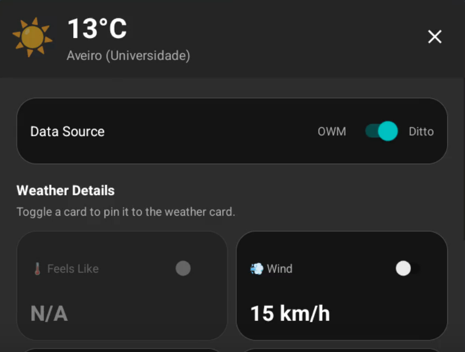

# Construction Improvements

After the MVP was completed, the next step was to improve the overall work pipeline, complete other use cases, improve the overall system and use the real sensor data we are provided.

## Work Pipeline Improvements

We started to improve the overall work, by working on branches acording to the feature being developed, and using pull requests to ask merges to main. The pull request needs to be reviewed and approved by at least 2 other developers and, on the backend repository, the code needs to pass github actions tests, to ensure security and that all our use cases are still validated.

## Use Case Development

These use cases were developed:

- [UC2: View Weather Conditions](../elaboration/use_cases.md#uc2.-view-weather-conditions)
- [UC4: Receive Safe Entry/Exit Instructions](../elaboration/use_cases.md#uc4.-receive-safe-entry-exit-instructions)
- [UC6: View Weather Alerts](../elaboration/use_cases.md#uc6.-view-weather-alerts)
- [UC7: View Accident Alerts](../elaboration/use_cases.md#uc7.-view-accident-alerts)
- [UC8: View Priority Vehicle Alerts](../elaboration/use_cases.md#uc8.-view-priority-vehicle-alerts)

**Important Note:** Navigation related features on these use cases were still not developed, as they have a lower priority for this project, and they will recieve more focus later on.

## Real data Implementation

### Overview

We have implemented real data integration into our system. We gained access to Weather Stations data and began validating the accuracy of sensor readings against external data sources (Weather API). Additionally, we received the data structure specifications the vehicle systems too, which will allow us to integrate real vehicle data soon.

#### Weather Stations Data Structure

```json
{
  "thingId": "meteo:1210702",
  "policyId": "meteo:default",
  "attributes": {
    "id": 1210702,
    "location": {
      "longitude": -8.6596,
      "latitude": 40.6353
    },
    "location_name": "Aveiro (Universidade)"
  },
  "features": {
    "meteorology": {
      "properties": {
        "wind_intensity": 15.5,
        "temperature": 13.5,
        "radiation": 1530.4,
        "wind_direction": 0,
        "accumulated_precipitation": 0,
        "pressure": 1028.9,
        "humidity": 63
      }
    }
  }
}
```

#### Vehicle Data Structure

```json
{
  "thingId": "tolls:lider-5",
  "policyId": "dt4mob:default",
  "attributes": {
    "objectId": 5,
    "expiry_ts": "2026-03-02T19:13:00.478986Z"
  },
  "features": {
    "State": {
      "properties": {
        "id": "5",
        "ts": "2026-03-02T19:12:30.478697Z",
        "extra": {
          "timeOfMeasurement": "2025-11-25T10:55:46.988086Z",
          "speedKmh": 2,
          "localCoordinates": {
            "x": 1.66258697213839673,
            "y": 23.5941424628173838
          },
          "absoluteCoordinates": {
            "latitude": 38.7111805614115095,
            "longitude": -9.38936852690132690
          },
          "dimensions": {
            "width": 1.902,
            "length": 4.823,
            "height": 1.189
          },
          "objectId": 5,
          "emergency": 0
        }
      }
    }
  }
}
```

### Data Comparison Analysis

We made a comparison between real Sensor Data and OpenWeather API data, using measurements from the same hour and date:

```
Aveiro (Universidade)
Station ID: 1210702
Location: (40.6353, -8.6596)

Temperature:    Station: 13.5°C    | OpenWeather: 14.5°C    | Diff: -1.0°C
Humidity:       Station: 63%       | OpenWeather: 78%       | Diff: -15%
Pressure:       Station: 1028.9hPa | OpenWeather: 1026.0hPa | Diff: +2.9hPa
Wind Speed:     Station: 15.5km/h  | OpenWeather: 10.6km/h  | Diff: +4.9km/h
```

### Frontend Implementation

We integrated the real sensor data into the frontend application. Users can now view weather conditions in the app using data from both the local weather sensors or using the OpenWeather API:


### Current Status

We have successfully received and documented the complete data structures for both weather stations and vehicles. Currently, weather station data is fully integrated into our production system (Ditto) and available through the frontend. Vehicle data integration is pending for future development phases.

---

**Tutors:**  
- Rafael Direito (rafael.neves.direito@ua.pt)  
- Diogo Gomes (dgomes@ua.pt)  

**Group:**
- Diogo Nascimento (dca.nascimento5@ua.pt)
- Duarte Branco (duartebranco@ua.pt)
- Eduardo Romano (eduardo.romano@ua.pt)
- Filipe Viseu (filipeviseu@ua.pt)
- Samuel Vinhas (samuelmvinhas@ua.pt)

**Institution:** Telecommunications Institute of Aveiro (ITAv)