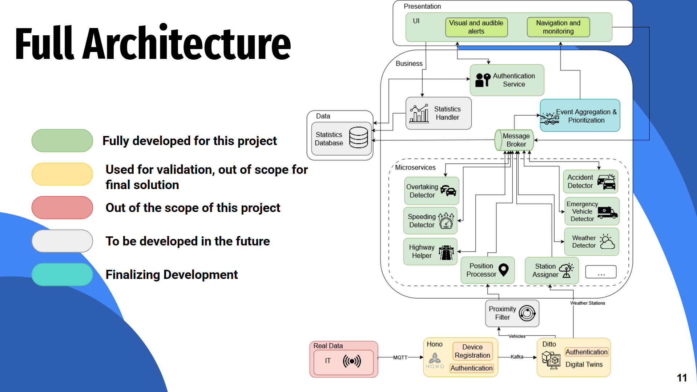

# Architecture

This document outlines the architecture of the Automotive App system as it stands in the prototype phase. It highlights our current implementations, including the processing pipeline, event filtering, and frontend interactions.

## Full System Architecture

Our overall architecture maps out the complete pipeline from data generation down to the in-car display.

During this phase, our architecture is built around several core operational modules:

### 1. Digital Twin Processing
Processing data at the edge via the Digital Twin framework to ensure that state changes and critical environment information are captured immediately.

### 2. Event Detection
Our backend systems process the live or simulated data to identify contextual situations on the road (such as accidents, speeding, or weather changes) and format them into relevant alerts.

### 3. Proximity Filter
A core concept of our current architecture. The Proximity Filter ensures that only relevant events within a specific radius and path configuration are sent to the driver, reducing distraction and preventing message flooding.

### 4. Frontend Interaction
The finalized events and warnings are delivered to the Android Automotive UI, ensuring a simple, clean, and intuitive interface with accessible alerts that appear in less than 2 seconds.

---

**Tutors:**  
- Rafael Direito (rafael.neves.direito@ua.pt)  
- Diogo Gomes (dgomes@ua.pt)  

**Group:**
- Diogo Nascimento (dca.nascimento5@ua.pt)
- Duarte Branco (duartebranco@ua.pt)
- Eduardo Romano (eduardo.romano@ua.pt)
- Filipe Viseu (filipeviseu@ua.pt)
- Samuel Vinhas (samuelmvinhas@ua.pt)

**Institution:** Telecommunications Institute of Aveiro (ITAv)