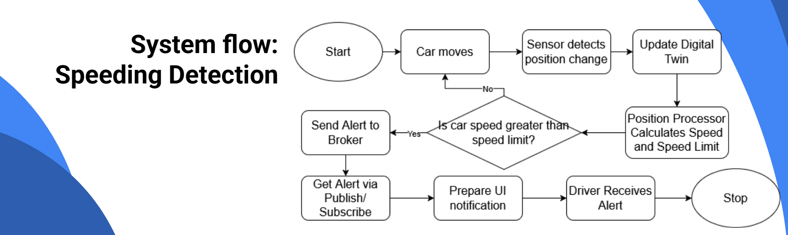

# Prototype Description

This milestone served as a recap of everything we have built and validated so far. 
The prototype phase focuses on demonstrating the core components of our app, consolidating the MVP made in last semester and showcasing the actual scenarios we can now handle using our prototype.
For anyone who didn't read the previous documentation, here is a quick recap of the main objectives and validation strategies we have followed during this phase:

## Objective

Our primary goal is to **develop an application for Android Automotive (AAOS)** that leverages sensor data around Aveiro to provide an **Automotive Unified Road Assistant**. 

By tapping into the **DT4MOB (Digital Twins for Mobility)** infrastructure (a Cloud2Edge infrastructure orchestrated with Kubernetes), our system gains access to:
* Faster communication and interaction between objects.
* Rapid and efficient event detection, which is critical for a real-time road assistance app.

## Validating Our Prototype

To assure the quality and correct functionality of the Prototype, our team validates our Use Cases through two primary strategies:

1. **Simulations**: We recreate the Digital Twin infrastructure with simulated data (e.g., simulating a Speeding Detection flow). This allows us to validate specific use cases that would otherwise be unreliable or dangerous to test with real data.
2. **Real-World Testing**: We run the app on an actual Automotive OS system (Khadas VIM3 Pro) with an Automotive Screen, driving around Aveiro to record and validate relevant events on the actual hardware.

---

**Tutors:**  
- Rafael Direito (rafael.neves.direito@ua.pt)  
- Diogo Gomes (dgomes@ua.pt)  

**Group:**
- Diogo Nascimento (dca.nascimento5@ua.pt)
- Duarte Branco (duartebranco@ua.pt)
- Eduardo Romano (eduardo.romano@ua.pt)
- Filipe Viseu (filipeviseu@ua.pt)
- Samuel Vinhas (samuelmvinhas@ua.pt)

**Institution:** Telecommunications Institute of Aveiro (ITAv)