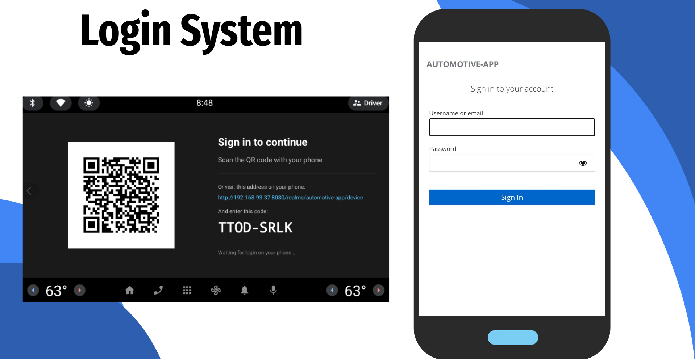

# Login System

During this prototype milestone, one of our major system improvements was the implementation of a **Login System** using **Keycloak**. 

With this new feature, by logging in, drivers can retrieve their personalized configurations, tailor their alert preferences, and maintain their driver profiles straight from the Android Automotive dashboard. This ensures that our app provides a more customized and secure experience tailored to the person using it.

---

**Tutors:**  
- Rafael Direito (rafael.neves.direito@ua.pt)  
- Diogo Gomes (dgomes@ua.pt)  

**Group:**
- Diogo Nascimento (dca.nascimento5@ua.pt)
- Duarte Branco (duartebranco@ua.pt)
- Eduardo Romano (eduardo.romano@ua.pt)
- Filipe Viseu (filipeviseu@ua.pt)
- Samuel Vinhas (samuelmvinhas@ua.pt)

**Institution:** Telecommunications Institute of Aveiro (ITAv)
