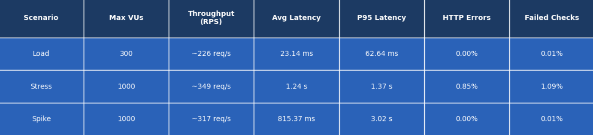
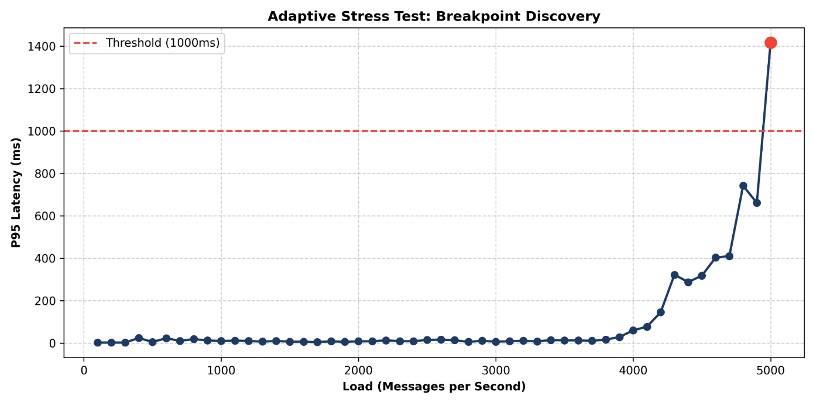

# Component Validation

To make sure our application was up to standards and capable of providing information quickly and efficiently, we made sure to prepare performace and scalability tests. This ensures our app is secure and capable of leveraging multiple users at the same time.

## Performance

For performance evaluations we focused on endpoints that were preferable for user interactivity. From results we obatined, we changed some aspects of our application to increase our performance metrics, such as changing our old databse flow. Instead of doing multiple micro queries to the database, which under higher loads kept the database ocuupied causing later requests to be blocked, we changed these into a single atomic query that handles higher complexity operation at business level, instead of at the database level. Through changes like this we have obtained the following results.

## Scalability

As for our horizontal scalability, it is assured by our architectural design, which relies on microservices that reduce the overall workload of the application by distributing traffic efficiently. As well as this, we have performed stress testing that shows **at how much workload the application start acting below our defined standard**.

**Tutors:**  
- Rafael Direito (rafael.neves.direito@ua.pt)  
- Diogo Gomes (dgomes@ua.pt)  

**Group:**
- Diogo Nascimento (dca.nascimento5@ua.pt)
- Duarte Branco (duartebranco@ua.pt)
- Eduardo Romano (eduardo.romano@ua.pt)
- Filipe Viseu (filipeviseu@ua.pt)
- Samuel Vinhas (samuelmvinhas@ua.pt)

**Institution:** Telecommunications Institute of Aveiro (ITAv)