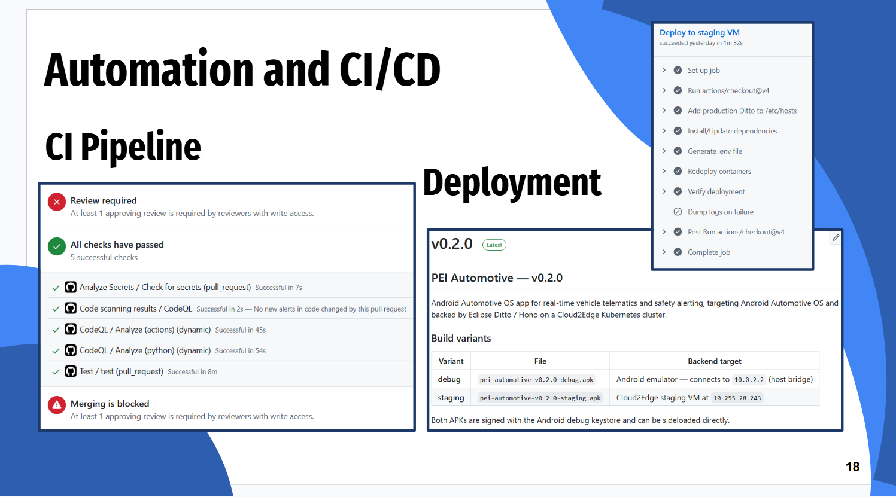

# Development Review

## Automation

As for our project's development, we have automated our intergration and deployment pipeline to ensure that this process was as quick and efficient as possible. Through a separation of our environment into a debug and a staging space, we can run quick tests in the debugging area, which runs services locally, while in the staging area we test our software in a more realistic condition, by connecting to a VM using Cloud2Edge.

## Version Control

We ensure our main project is unburdened by any major bugs or issues, we make sure to control changes and commits through Pull Requests. Each PR is evaluated by one other member of our team, to garantee that at any change made is approved by at least 2 contributors.
Over the course of this project, we have done 67 Pull Requests, 33 in our app's frontend and 34 in the backend.
However, due to the nature of our project, some edge cases may bypass standard testing, and still cause some bugs in more complex scenarios.

## What was not done

1. **Alerts**

While we provide information about many road conditions, one that we were not able to cover were alerts for general hazards. Likewise, we warn users of any risky maneuver that they may be doing, but dont have anything that then tells them what the correct thing to do is.

2. **Routes**

We have routes that allow a user to know how to get from one point to another, however, we failed to optimize this service to allow the choices between faster, shorter or sefer routes, as well as adaptive routes that change course when certain events are detected.

3. **Statistics**

Lastly, we had thought of, but eventually discarded the idea of implementing historical statistics of events.

---

**Tutors:**  
- Rafael Direito (rafael.neves.direito@ua.pt)  
- Diogo Gomes (dgomes@ua.pt)  

**Group:**
- Diogo Nascimento (dca.nascimento5@ua.pt)
- Duarte Branco (duartebranco@ua.pt)
- Eduardo Romano (eduardo.romano@ua.pt)
- Filipe Viseu (filipeviseu@ua.pt)
- Samuel Vinhas (samuelmvinhas@ua.pt)

**Institution:** Telecommunications Institute of Aveiro (ITAv)