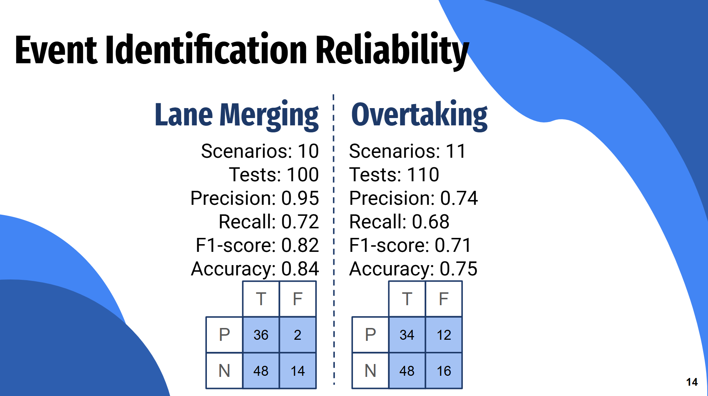

# Security

## Security Enhancements

This section outlines the recent security upgrades and current status of measures implemented across the application ecosystem, focusing on authentication, secure storage, message broker access control, and transport encryption.

* **Authentication via Keycloak:** Implemented the **OAuth 2.0 Device Authorization Grant (RFC 8628)** to securely authenticate internet-connected devices and applications that lack a browser or have limited input capabilities.
* **Secure Token Storage:** Configured **Android’s EncryptedSharedPreferences** on the client side to securely store access and refresh tokens, utilizing **AES-256-GCM** encryption backed by the Android Keystore system.
* **MQTT Broker Security & ACLs:** Established a dual-authentication mechanism for the MQTT broker. Backend microservices authenticate using static credentials and are granted full **read/write** permissions. Android clients connect securely by passing their **JWT** (validated in real-time by the **go-auth plugin** against Keycloak) and are strictly limited by Access Control Lists (ACLs) to **read-only** access on specific topics.
* **Transport Encryption Status:** Secured data in transit across most of the architecture, with **HTTPS** fully enforced for connections to Keycloak, Eclipse Ditto, and the backend APIs. Encryption for the MQTT broker connections (MQTTS) is still pending implementation.

## OWASP

This section maps our current application safeguards, pending tasks, and defensive practices to the relevant **OWASP Top 10** vulnerability categories.

* **A01:2021 – Broken Access Control**
  * **Implementation:** Mitigated by implementing Access Control Lists (ACLs) within the MQTT broker. This ensures strict privilege isolation: mobile Android clients are restricted to **read-only** access on specific topics, whereas backend microservices maintain full **read/write** access.

* **A05:2021 – Security Misconfiguration**
  * **Current Status:** Identified configurations regarding the MQTT broker that are still in transition to secure protocols (**HTTPS/MQTTS**). Fully migrating these connections is a priority to close transport layer gaps and resolve active misconfigurations.

* **A06:2021 – Vulnerable and Outdated Components** *(Formerly Software Supply Chain Failures)*
  * **Implementation:** Adopted aggressive **version freezing** across package management files to lock in stable, verified versions of dependencies. Additionally, integrated **`pip audit`** into development workflows to actively scan for and report known vulnerabilities within third-party packages.

* **A02:2021 – Cryptographic Failures**
  * **Implementation:** Enforced a policy to exclusively use standard, well-trusted implementations of cryptographic algorithms (such as **AES-256-GCM** via Android's EncryptedSharedPreferences) rather than designing custom encryption logic, drastically reducing the risk of implementation flaws.

## Reliabilitiy Tests

Lastly we have made some tests of our services, to make sure that they provide accurate information.

---

**Tutors:**  
- Rafael Direito (rafael.neves.direito@ua.pt)  
- Diogo Gomes (dgomes@ua.pt)  

**Group:**
- Diogo Nascimento (dca.nascimento5@ua.pt)
- Duarte Branco (duartebranco@ua.pt)
- Eduardo Romano (eduardo.romano@ua.pt)
- Filipe Viseu (filipeviseu@ua.pt)
- Samuel Vinhas (samuelmvinhas@ua.pt)

**Institution:** Telecommunications Institute of Aveiro (ITAv)